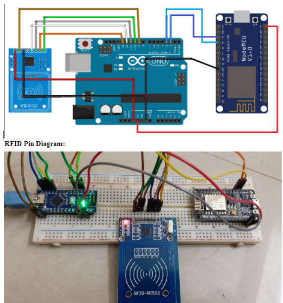

# IoT-Based-RFID-Inventory-Management-System-using-Arduino-Node-MCU-ESP8266-Arduino-Adafruit.io

<b>INTRODUCTION</b>  
The main objective of this project is to make IoT Based RFID Inventory Management System using Arduino Node MCU ESP8266 Arduino & Adafruit.io Platform using MQTT broker. So we will use RFID MFRC522, Arduino Nano and Node MCU ESP-12E Board. Arduino and RFID scanner scans the RFID cards and then log the data to Adafruit IO cloud platform with the help of ESP8266 Wi-Fi module. This information can be displayed in the Adafruit IO dashboard and can be accessed by the required authorities to view and analyze the inventory over the internet from anywhere at any time. 

<b>PROBLEM STATEMENT</b>  To develop an Inventory Management system using rfid sensor and arduino nano.Using Node MCU to Sent Data to cloud(Adafruit). 

</b>HARDWIRE REQUIRED </b>
1. Arduino Nano 
2. MFRC522 RFID Scanner Module 
3. 13.56 Mhz RFID Cards 
4. NodeMCU ESP-12E Board 
5. Breadboard 
6. Jumper Wires 

</b>Drive link for project videos,code,libraries: </b>
<a href="https://drive.google.com/drive/folders/16V5cI8NvSfmOW_UIq7wuA8P2WyMTvHN7?usp=sharing">Link</a>

<b> Circuit Diagram</b>

 
 
 <h2><b><i>Thank You<i></b><h2>

